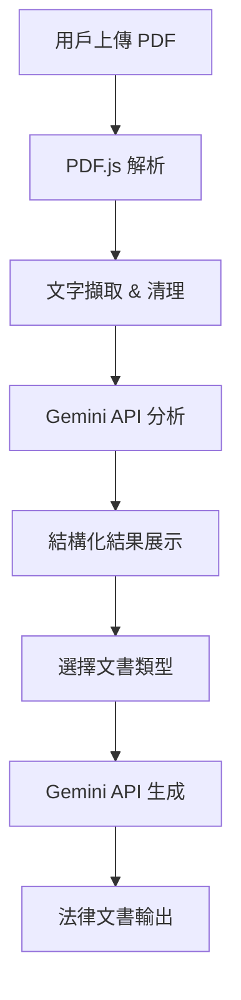

# 🏛️ LegalMind AI - 判決分析與訴狀生成助手

[](https://github.com/yourusername/legalmind-ai/actions)
[](https://www.typescriptlang.org/)
[](https://reactjs.org/)
[](https://vitejs.dev/)

> 🎓 專為台灣法律教育設計的 AI 驅動判決分析與訴狀生成工具

## ✨ 功能特色 

### 🔍 智能判決分析
- **PDF 文檔解析**：支援台灣法院判決書 PDF 格式
- **結構化分析**：自動提取案件資訊、爭點、事實認定
- **優劣分析**：智能識別對當事人有利/不利的判決要點
- **法條檢索**：相關法律條文自動標註

### 📝 自動訴狀生成
- **多種文書類型**：民事上訴狀、刑事上訴狀、答辯狀、起訴狀
- **台灣法院格式**：完全符合台灣法院書狀格式要求
- **智能推理**：基於判決分析結果生成具針對性的法律論述
- **一鍵下載**：支援 Word/PDF 格式匯出

### 🎯 專業特色
- **教育導向**：特別為法律系學生和實習律師設計
- **中文最佳化**：完整支援繁體中文法律術語
- **隱私保護**：本地處理，不儲存敏感案件資訊
- **免費使用**：開源專案，完全免費

## 🚀 線上試用

**立即體驗：** [https://yourusername.github.io/legalmind-ai/](https://yourusername.github.io/legalmind-ai/)

## 🛠️ 技術架構

### 核心技術棧
```
Frontend:  React 18 + TypeScript + Vite
UI/UX:     Lucide Icons + Custom CSS
PDF:       PDF.js (中文字符支援)
AI:        Gemini 2.5 Flash API
Deploy:    GitHub Pages + GitHub Actions
```

### 系統架構


## 💻 本地開發

### 環境需求
- Node.js 18+ 
- npm 或 yarn
- 現代瀏覽器（支援 ES2020）

### 快速開始
```bash
# 1. 克隆專案
git clone https://github.com/yourusername/legalmind-ai.git
cd legalmind-ai

# 2. 安裝依賴
npm install

# 3. 設定環境變數
cp .env.example .env.local
# 編輯 .env.local，設定你的 Gemini API Key

# 4. 啟動開發服務器
npm run dev

# 5. 開啟瀏覽器
# http://localhost:3000
```

### 環境變數配置
```env
VITE_GEMINI_API_KEY=你的_Gemini_API_金鑰
VITE_APP_VERSION=1.0.0
VITE_APP_ENV=development
```

### 建置與部署
```bash
# 類型檢查
npm run type-check

# 建置生產版本
npm run build

# 預覽建置結果
npm run preview

# 部署到 GitHub Pages
npm run deploy
```

## 📁 專案結構

```
legalmind-ai/
├── public/                 # 靜態資源
├── src/
│   ├── components/        # React 組件
│   │   ├── AnalysisView/  # 判決分析展示
│   │   ├── DocumentGen/   # 文書生成
│   │   └── FileUpload/    # 檔案上傳
│   ├── services/          # 業務邏輯
│   │   ├── pdfService.ts  # PDF 處理
│   │   ├── geminiService.ts # AI API 整合
│   │   └── docGenerator.ts # 文書生成
│   ├── types/            # TypeScript 類型定義
│   ├── utils/            # 工具函數
│   ├── App.tsx           # 主應用組件
│   ├── App.css           # 樣式文件
│   └── main.tsx          # 應用入口
├── .github/
│   └── workflows/
│       └── deploy.yml    # CI/CD 配置
├── package.json
├── vite.config.ts
├── tsconfig.json
└── README.md
```

## 🔧 自訂部署

### 1. Fork 專案
```bash
# 在 GitHub 上 Fork 這個專案
# 然後克隆你的 fork
git clone https://github.com/你的用戶名/legalmind-ai.git
```

### 2. 設定 GitHub Secrets
在你的 GitHub 專案中設定以下 Secrets：
- `GEMINI_API_KEY`: 你的 Google Gemini API 金鑰

### 3. 修改配置
```typescript
// vite.config.ts
export default defineConfig({
  base: '/你的專案名稱/',  // 修改為你的 GitHub repo 名稱
  // ...其他配置
})
```

### 4. 啟用 GitHub Pages
- 前往專案 Settings → Pages
- 選擇 Source: GitHub Actions
- 推送代碼到 main 分支即自動部署

## 🎓 教學用途

### 法學院整合建議
- **民事訴訟法課程**：練習上訴狀撰寫
- **刑事訴訟法課程**：判決書解讀訓練
- **法律寫作課程**：法律文書格式學習
- **實習律師訓練**：案件分析能力培養

### 使用場景
1. **課堂演示**：教授展示判決分析流程
2. **學生練習**：學生自主練習法律寫作
3. **模擬法庭**：快速準備法庭文書
4. **研究輔助**：法律研究的前期分析工具

## 🔒 隱私與安全

- ✅ **本地處理優先**：PDF 解析在用戶端進行
- ✅ **不儲存敏感資料**：系統不保留案件資訊
- ✅ **API 安全**：所有 API 調用使用 HTTPS
- ✅ **開源透明**：完整程式碼公開可審查

## 🤝 貢獻指南

歡迎任何形式的貢獻！請閱讀 [貢獻指南](CONTRIBUTING.md) 了解詳情。

### 開發貢獻
1. Fork 專案
2. 創建特性分支：`git checkout -b feature/amazing-feature`
3. 提交變更：`git commit -m 'Add amazing feature'`
4. 推送分支：`git push origin feature/amazing-feature`
5. 開啟 Pull Request

### 問題回報
- 使用 [Issues](https://github.com/yourusername/legalmind-ai/issues) 回報 bug
- 提供詳細的重現步驟和環境資訊
- 附上相關的截圖或錯誤訊息

## 📋 待辦事項

### 短期目標 (v1.1)
- [ ] 支援更多判決書格式
- [ ] 增加法條資料庫整合
- [ ] 優化 AI 分析準確度
- [ ] 添加使用教學影片

### 中期目標 (v2.0)
- [ ] 多案件批次處理
- [ ] 判決書品質評估
- [ ] 案例比對分析功能
- [ ] 多語言支援（英文）

### 長期目標 (v3.0)
- [ ] 整合台灣法學資料庫
- [ ] 機器學習模型優化
- [ ] 移動端 PWA 應用
- [ ] 法律事務所版本

## 📜 授權條款

本專案採用 MIT 授權條款 - 詳見 [LICENSE](LICENSE) 文件

## 👨‍🏫 關於作者

**Jackie** - 輔仁大學法律學院、中原大學法律學院 AI 整合教學教授

- 🎯 專長：法律科技、AI 在法學教育之應用
- 🏢 現職：數位發展部第三方支付業者審查委員會委員
- 🎓 認證：n8n Level 2 + 23項 AI 相關認證
- 📧 聯絡：[您的聯絡方式]

## 🙏 致謝

- Google Gemini API 提供強大的 AI 分析能力
- PDF.js 提供優秀的 PDF 處理功能
- React 社群的持續支持
- 台灣法律教育界的寶貴建議

## 📊 專案統計


---

💡 **專案願景**：讓 AI 技術真正服務於台灣法律教育，培養新世代法律人的數位素養。

**⭐ 如果這個專案對您有幫助，請給我們一個星星！**
